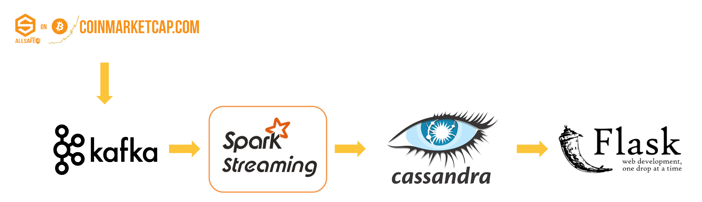

# Decrypt Diversity of Cryptocoins

## Summary
A pipeline to show the quasi-realtime correlation matrix (the latest one hour) as heatmap for streaming cryptocoins data. This project was built during being as a Data Engineering Fellow at Insight Data Science.

* [Web service](http://youtu.be/uiqITDmj5Jc) URL: youtu.be/uiqITDmj5Jc

* [Slides](http://goo.gl/jEZFXK) URL: goo.gl/jEZFXK

* [Video](http://youtu.be/uiqITDmj5Jc) URL: youtu.be/uiqITDmj5Jc


## Project idea in 1-sentence
To provide a quasi-realtime information platform for risk management system in cryptocurrency market.


## Purpose and Use cases
### Purpose
Whenever people invest in financial market, they want to reduce the risk by diversifying their portfolio.
Otherwise, they may become either very rich, or very poor. For example, someone invests money into two coins, coin A and coin B. If price A and price B are highly correlated, which means that their prices may go high or drop dramatically together, then that person will become very rich, or extremely poor. That is something people are not looking forward to.

The metric for this case is the correlations between all the investment targets. However, unlike the stock market, in which all the correlations have been well studied, correlations between different cryptocoins haven't been well understood yet. Moreover, correlations may change in different time period. As a result, to meet this desire, I decided to build this platform.

### Use cases
1. A Tool for data scientists to acquire cryptocoins historical data.
2. An information provider system for real-time portfolio management system.
3. A web API, which returns a list of json objects with all the information, including price, volume, and correlations.


## Web service
### Interface
1. Show the **Correlation Matrix** as heatmap for 10 cryptocoins which have the top 10 market value.
2. Let user to look up **Correlation** (the latest one hour) by specifying **ID** of two coins.
3. Visualization of **Price** and **Volume** information vs **Time Interval** on a chart.
4. Let user to change the **Price** and **Volume** by specifying **ID** of a coin.


## Architecture
### Technologies
* Kafka (3 nodes)
* Spark Streaming (4 nodes)
* Cassandra (3 nodes)
* Flask (1 node)

**Note:** Kafka, Spark Streaming, and Cassandra are all distributed systems.


### ETL Data Pipeline



### Instance Specs
* 11 nodes in total
* Amazon Web Services (AWS)
* Amazon Elastic Compute Cloud (Amazon EC2) m4.large


## Scalability
This data pipeline can scale up to 100x, which means it can handle the following:

* Scalability: 100x
* 1 record / 100ms
* 2.6 MB/sec
* 700 GB/day


## Dependency
### Python libraries
* send http requests
```
pip install requests
```

* Kafka
```
pip install kafka-python
```

* Cassandra driver
```
pip install cassandra-driver
```

* Flask
```
pip install flask
```

* Tornado
```
pip install tornado
```
